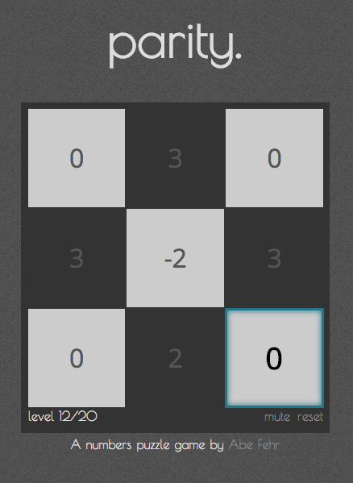

[Parity](http://abefehr.com/parity/)
======

Parity is a simple numbers puzzle game written in Javascript. It was inspired by OCD-like impulses to make sure the icons on my desktop were all selected the same number of times.

  

How to play
===========

The game is played by moving a cursor around the board to select different squares in a grid. Each time you select a select a cell by moving the cursor with the arrow keys, the number inside that cell increases by one.

The goal of the game is to make each number on the board equal.

Mobile
======

Parity is mobile-friendly. Simply visit the website on your device's browser to play. It's recommended that you add the page to your home screen if you own an iPhone for a better experience.

License
=======
Parity is licensed under the [MIT license.](https://github.com/abejfehr/parity/blob/master/LICENSE.txt)
